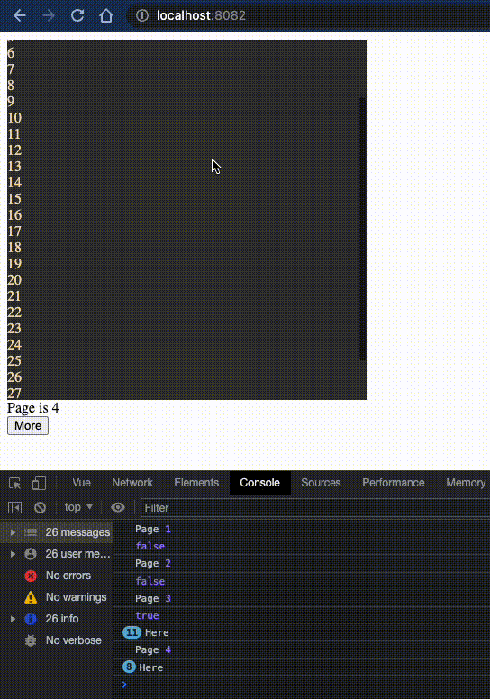

# vue-pagination

### Roadmap
- [x] usePagination
- [x] useMultiPagination
- [x] Scrollable container component
- [ ] Virtual render
- [ ] Documentation

### Install
```shell
npm i vue3-pager
```

### Example 

```vue
<template>
  <div>
    <div style="height: 400px; width: 400px; background: #333; color: wheat;">
      <ScrollContainer :trigger-load="dummyPaginator.loadMore">
        <div v-for="it in items" :key="it" v-html="it"/>
      </ScrollContainer>
    </div>

    <div>Page is {{ dummyPaginator.page }}</div>

    <button @click="dummyPaginator.loadMore()">More</button>
  </div>
</template>

<script lang="ts">
import {defineComponent, ref} from "vue";
import ScrollContainer from "@/lib/ScrollContainer.vue";
import {usePagination} from "@/lib/pagination";

export default defineComponent({
  name: "DummyEndlessScroll",
  components: {ScrollContainer},

  setup() {
    const items = ref<string[]>([]);

    async function generateItemsForPage(page: number): Promise<boolean> {
      const newItems = new Array(10).fill(0).map((v, i) => {
        return '' + ((i + (page - 1) * 10) + 1);
      })

      // simulate network load
      await new Promise((resolve) => {
        setTimeout(resolve, 350)
      })

      items.value.push(...newItems)

      return true;
    }

    const dummyPaginator = usePagination({loadData: generateItemsForPage})

    return {items, dummyPaginator};
  }
})
</script>
```